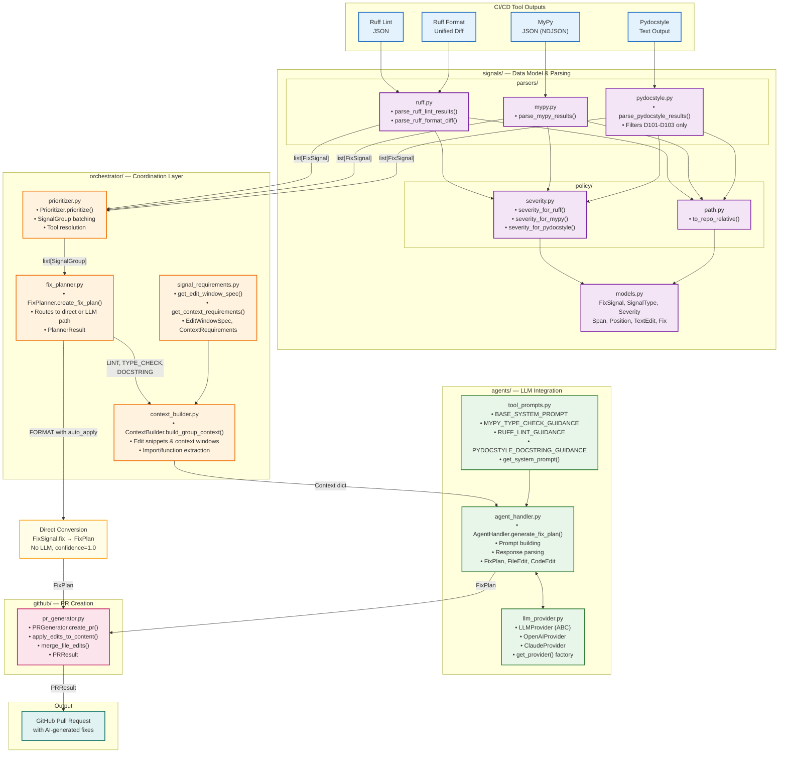
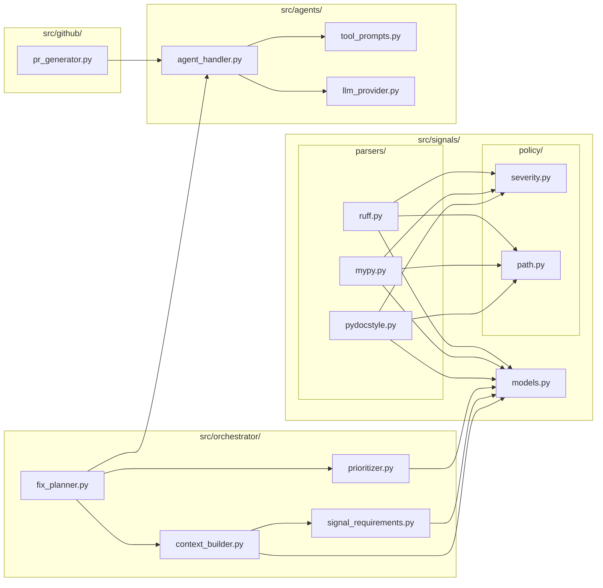
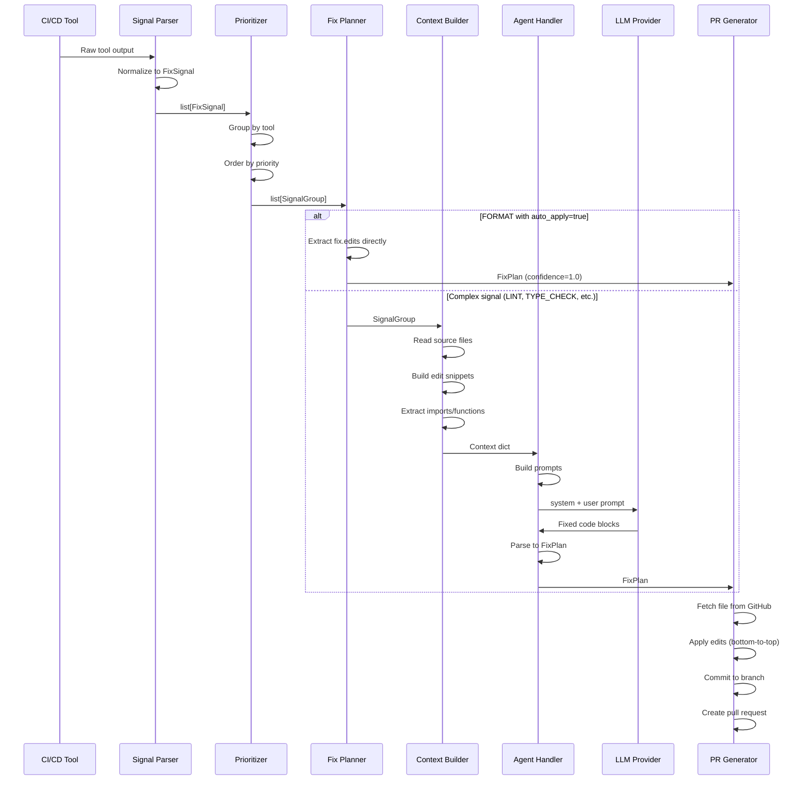
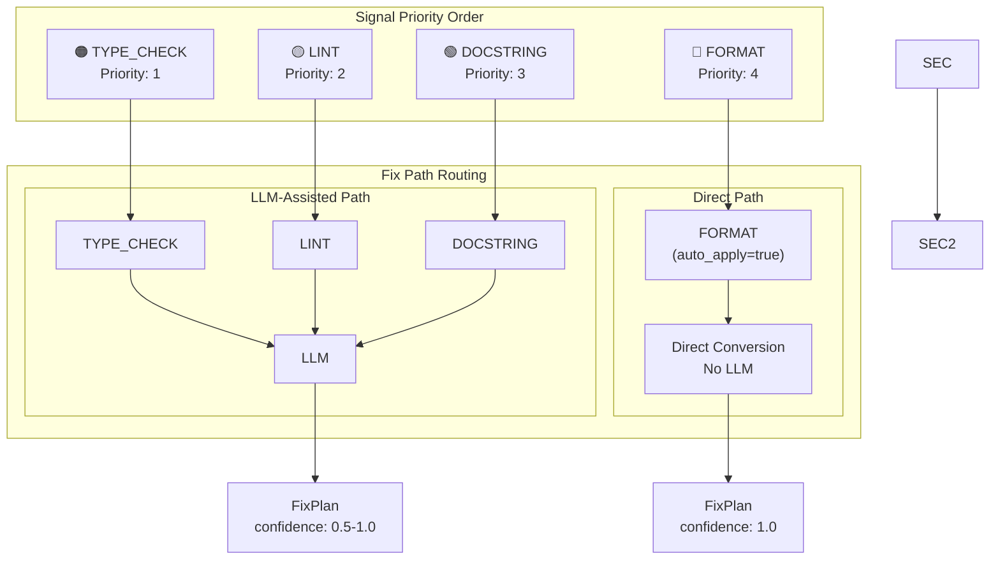
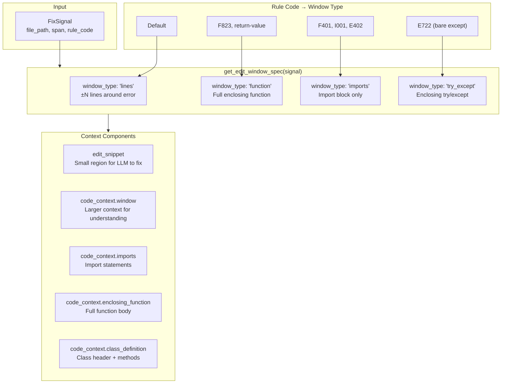
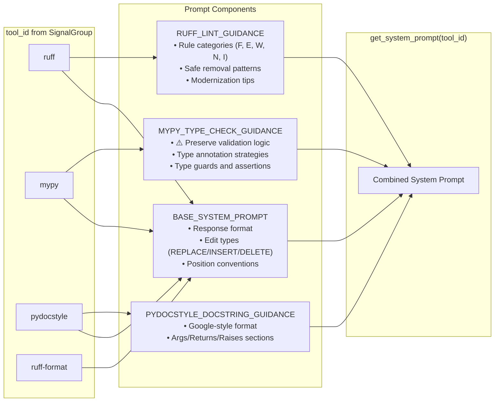
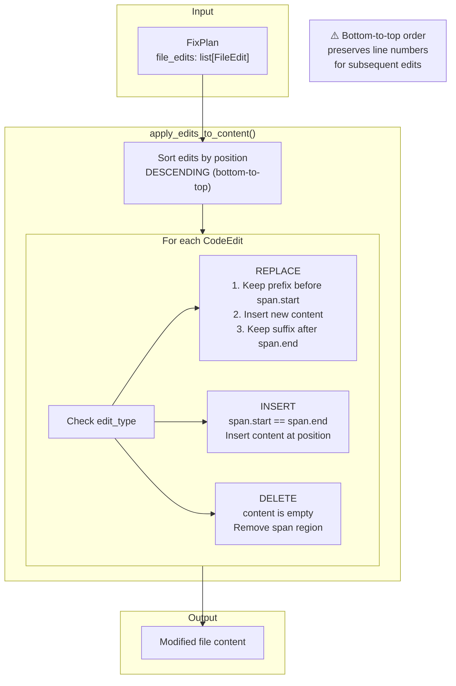

# Module Architecture & Data Flow Diagram

Comprehensive diagram of the CI/CD AI Assistant architecture showing all modules, data structures, and processing flows.

---

## System Overview Diagram



---

## Detailed Module Diagram



---

## Data Flow: FixSignal Through Pipeline



---

## Signal Type Priority & Routing



---

## Context Building Detail



---

## Tool-Specific Prompt Composition



---

## Edit Application Flow



---

## Core Data Structures

### FixSignal (signals/models.py)

```python
class SignalType(str, Enum):
    LINT = "lint"           # Code quality (ruff)
    FORMAT = "format"       # Formatting (ruff format)
    TYPE_CHECK = "type_check"  # Type errors (mypy)
    DOCSTRING = "docstring" # Missing docs (pydocstyle)

class Severity(str, Enum):
    CRITICAL = "critical"
    HIGH = "high"
    MEDIUM = "medium"
    LOW = "low"

@dataclass(frozen=True)
class FixSignal:
    signal_type: SignalType
    severity: Severity
    file_path: str              # Repo-relative path
    span: Optional[Span]        # Error location
    rule_code: Optional[str]    # e.g., "F401", "arg-type", "D101"
    message: str
    docs_url: Optional[str]
    fix: Optional[Fix]          # Deterministic fix (if available)
```

### SignalGroup (orchestrator/prioritizer.py)

```python
@dataclass(frozen=True)
class SignalGroup:
    tool_id: str              # "ruff", "mypy", "pydocstyle", "ruff-format"
    signal_type: SignalType
    signals: list[FixSignal]  # Batched signals (max 3, or all for same-file FORMAT)
```

### EditWindowSpec (orchestrator/signal_requirements.py)

```python
EditWindowType = Literal["lines", "function", "imports", "try_except"]

@dataclass(frozen=True)
class EditWindowSpec:
    window_type: EditWindowType
    lines: int = 0              # For window_type='lines'
    min_context_lines: int = 10
    min_edit_lines: int = 2

@dataclass(frozen=True)
class ContextRequirements:
    include_imports: bool = True
    include_enclosing_function: bool = True
    include_try_except: bool = False
    needs_class_definition: bool = False
    needs_type_aliases: bool = False
    needs_related_functions: bool = False
```

### FixPlan (agents/agent_handler.py)

```python
class EditType(str, Enum):
    REPLACE = "replace"
    INSERT = "insert"
    DELETE = "delete"

@dataclass
class CodeEdit:
    edit_type: EditType
    span: Span
    content: str
    description: str

@dataclass
class FileEdit:
    file_path: str
    edits: list[CodeEdit]
    reasoning: str

@dataclass
class FixPlan:
    group_tool_id: str
    group_signal_type: str
    file_edits: list[FileEdit]
    summary: str
    warnings: list[str]
    confidence: float  # 0.0-1.0
```

### PRResult (github/pr_generator.py)

```python
@dataclass
class PRResult:
    success: bool
    pr_url: Optional[str]
    pr_number: Optional[int]
    branch_name: Optional[str]
    error: Optional[str]
    files_changed: list[str]
```

---

## File Structure

```
src/
├── signals/
│   ├── __init__.py
│   ├── models.py                 # FixSignal, SignalType, Severity, Span, Position, Fix, TextEdit
│   ├── parsers/
│   │   ├── __init__.py
│   │   ├── ruff.py              # parse_ruff_lint_results(), parse_ruff_format_diff()
│   │   ├── mypy.py              # parse_mypy_results()
│   │   └── pydocstyle.py        # parse_pydocstyle_results()
│   └── policy/
│       ├── __init__.py
│       ├── severity.py          # severity_for_ruff(), severity_for_mypy(), severity_for_pydocstyle()
│       └── path.py              # to_repo_relative()
│
├── orchestrator/
│   ├── __init__.py
│   ├── prioritizer.py           # SignalGroup, Prioritizer
│   ├── signal_requirements.py   # EditWindowSpec, ContextRequirements, get_edit_window_spec()
│   ├── context_builder.py       # ContextBuilder.build_group_context()
│   └── fix_planner.py           # FixPlanner.create_fix_plan(), PlannerResult
│
├── agents/
│   ├── __init__.py
│   ├── tool_prompts.py          # BASE_SYSTEM_PROMPT, tool-specific guidance, get_system_prompt()
│   ├── agent_handler.py         # AgentHandler, FixPlan, FileEdit, CodeEdit, AgentResult
│   └── llm_provider.py          # LLMProvider (ABC), OpenAIProvider, ClaudeProvider, get_provider()
│
└── github/
    ├── __init__.py
    └── pr_generator.py          # PRGenerator, PRResult, apply_edits_to_content()
```

---

## Entry Point Pseudocode

```python
def main():
    # 1. Collect CI/CD tool outputs
    ruff_lint = read_file("ruff-lint-results.json")
    ruff_format = read_file("ruff-format.diff")
    mypy_output = read_file("mypy-results.json")
    pydocstyle_output = read_file("pydocstyle-output.txt")

    # 2. Parse into unified FixSignal format
    signals: list[FixSignal] = []
    signals.extend(parse_ruff_lint_results(ruff_lint))
    signals.extend(parse_ruff_format_diff(ruff_format))
    signals.extend(parse_mypy_results(mypy_output))
    signals.extend(parse_pydocstyle_results(pydocstyle_output))

    # 3. Group and prioritize
    prioritizer = Prioritizer(max_group_size=3)
    signal_groups = prioritizer.prioritize(signals)
    # Returns: [TypeCheckGroup, LintGroup, ..., FormatGroup]

    # 4. Generate fix plans
    fix_planner = FixPlanner(llm_provider="anthropic", repo_root=".")

    for group in signal_groups:
        result = fix_planner.create_fix_plan(group)
        # Routes to:
        #   - Direct path for FORMAT (no LLM)
        #   - LLM path for others (context → prompt → LLM → parse)

        if result.success:
            # 5. Create PR
            pr_generator = PRGenerator()
            pr_result = pr_generator.create_pr(result.fix_plan)
            print(f"Created PR: {pr_result.pr_url}")
```

---

## Design Principles

| Principle | Implementation |
|-----------|----------------|
| **Tool Agnosticism** | All tools normalized to `FixSignal` — parsers encapsulate tool-specific logic |
| **Two-Tier Fix Strategy** | Fast deterministic path for FORMAT, intelligent LLM path for complex signals |
| **Priority-Based Processing** | TYPE_CHECK > LINT > DOCSTRING > FORMAT |
| **Signal-Specific Context** | `EditWindowSpec` and `ContextRequirements` tailor context per rule code |
| **Tool-Specific Prompts** | Each tool gets specialized LLM guidance (mypy: preserve validation, ruff: safe removal, etc.) |
| **Immutable Data Flow** | Frozen dataclasses prevent accidental mutations between pipeline stages |
| **Provider Abstraction** | `LLMProvider` ABC allows swapping OpenAI/Anthropic without changing business logic |
| **Bottom-to-Top Edit Application** | Preserves line numbers when applying multiple edits to same file |
