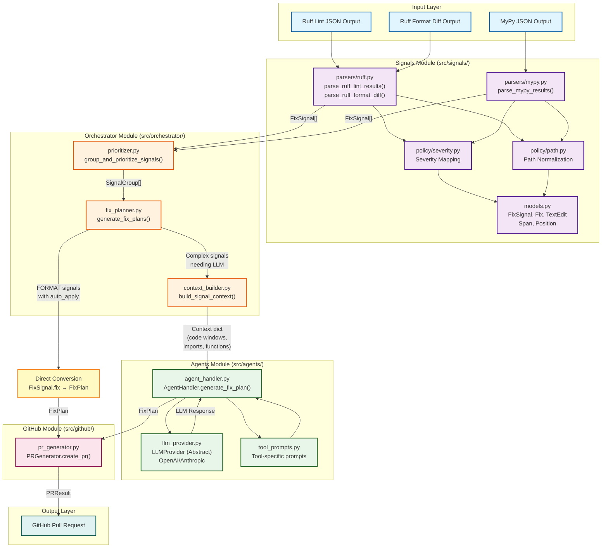

# Module Architecture & Data Flow Diagram

This diagram shows the complete module structure of the CI/CD AI Assistant, including all data interfaces and connections between modules.

## Module Connection Diagram



## Data Structures & Interfaces

### 1. FixSignal (signals/models.py)
**Output from parsers → Input to prioritizer**

```python
@dataclass(frozen=True)
class FixSignal:
    signal_type: SignalType          # LINT | FORMAT | TYPE_CHECK | SECURITY
    severity: Severity               # CRITICAL | HIGH | MEDIUM | LOW
    file_path: str                   # Repo-relative path
    span: Optional[Span]             # Location (start/end Position)
    rule_code: Optional[str]         # e.g., "E501", "unused-ignore"
    message: str                     # Human-readable description
    docs_url: Optional[str]          # Link to rule documentation
    fix: Optional[Fix]               # Deterministic fix (if available)
```

**Supporting Types:**
```python
@dataclass(frozen=True)
class Position:
    row: int        # 1-based line number
    column: int     # 0 or 1-based depending on tool

@dataclass(frozen=True)
class Span:
    start: Position
    end: Position

@dataclass(frozen=True)
class Fix:
    applicability: FixApplicability  # SAFE | UNSAFE | UNKNOWN
    message: Optional[str]
    edits: Sequence[TextEdit]

@dataclass(frozen=True)
class TextEdit:
    span: Span
    content: str    # Replacement text
```

---

### 2. SignalGroup (orchestrator/prioritizer.py)
**Output from prioritizer → Input to fix planner**

```python
@dataclass(frozen=True)
class SignalGroup:
    tool_id: str              # "ruff", "mypy", "ruff-format"
    signal_type: SignalType   # Type of signals in this group
    signals: list[FixSignal]  # Max 3 signals (or all for same-file FORMAT)
```

**Grouping Logic:**
- FORMAT signals: One group per file (all FORMAT signals for that file)
- Other signals: Grouped by tool_id, max 3 per group
- Sorted by priority: SECURITY > TYPE_CHECK > LINT > FORMAT

---

### 3. Context Dictionary (orchestrator/context_builder.py)
**Output from context builder → Input to agent handler**

```python
{
    "signal": FixSignal,                    # The signal being fixed
    "full_file_content": str,               # Complete file content
    "code_window": FileSnippet,             # ±30 lines around error
    "edit_snippet": EditSnippet,            # ±3 lines around error
    "imports": list[str],                   # Import statements from file
    "enclosing_function": Optional[str],    # Function containing the error
    "related_code": Optional[str]           # Additional context if needed
}
```

**Supporting Types:**
```python
@dataclass(frozen=True)
class FileSnippet:
    file_path: str
    start_row: int      # 1-based
    end_row: int        # 1-based, inclusive
    text: str           # Code content

@dataclass(frozen=True)
class EditSnippet:
    file_path: str
    start_row: int
    end_row: int
    text: str
    base_indent: str    # Leading whitespace of error line
    error_line_in_snippet: int  # 1-based position of error in snippet
```

---

### 4. FixPlan (agents/agent_handler.py)
**Output from agent handler OR direct conversion → Input to PR generator**

```python
@dataclass
class FixPlan:
    group_tool_id: str              # Source tool (e.g., "ruff")
    group_signal_type: str          # "LINT", "FORMAT", etc.
    file_edits: list[FileEdit]      # Edits grouped by file
    summary: str                    # Human-readable description
    warnings: list[str]             # Any caveats or concerns
    confidence: float               # 0.0 to 1.0
```

**Supporting Types:**
```python
@dataclass
class FileEdit:
    file_path: str
    edits: list[CodeEdit]   # Applied bottom-to-top (reverse line order)
    reasoning: str          # Why these changes were made

@dataclass
class CodeEdit:
    edit_type: EditType     # REPLACE | INSERT | DELETE
    span: Span              # Location to edit
    content: str            # New content (empty for DELETE)
    description: str        # What this edit does

@dataclass(frozen=True)
class Position:
    row: int        # 1-based line number
    column: int     # 0-based character offset

@dataclass(frozen=True)
class Span:
    start: Position
    end: Position
```

---

### 5. PRResult (github/pr_generator.py)
**Output from PR generator → Final result**

```python
@dataclass
class PRResult:
    success: bool
    pr_url: Optional[str]       # e.g., "https://github.com/owner/repo/pull/123"
    pr_number: Optional[int]    # e.g., 123
    branch_name: Optional[str]  # e.g., "fix/ruff-lint-abc123"
    error: Optional[str]        # Error message if success=False
    files_changed: list[str]    # List of modified file paths
```

---

## Processing Paths

### Path A: Direct Conversion (Fast Path)
**For:** FORMAT signals with `auto_apply=True`

```
FixSignal with Fix
    ↓
[FixPlanner] Convert Fix.edits to FixPlan.file_edits
    ↓
FixPlan (no LLM call needed)
```

### Path B: LLM-Assisted (Smart Path)
**For:** Complex signals (LINT, TYPE_CHECK, SECURITY) or FORMAT without auto_apply

```
SignalGroup
    ↓
[ContextBuilder] Extract code context
    ↓
Context dict (code windows, imports, functions)
    ↓
[AgentHandler] Build prompt with tool-specific guidance
    ↓
[LLMProvider] Call OpenAI/Anthropic API
    ↓
LLM Response (structured text with EDIT blocks)
    ↓
[AgentHandler] Parse response into FixPlan
    ↓
FixPlan
```

---

## Module Responsibilities

| Module | Primary Responsibility | Key Abstraction |
|--------|------------------------|-----------------|
| **Signals** | Normalize tool outputs into unified format | `FixSignal` |
| **Orchestrator** | Group, prioritize, and route signals | `SignalGroup` |
| **Agents** | Generate intelligent fixes via LLM | `FixPlan` |
| **GitHub** | Apply fixes and create pull requests | `PRResult` |

---

## Entry Point (To Be Implemented)

The main entry point would orchestrate these modules:

```python
def main():
    # 1. Collect tool outputs
    ruff_lint_json = run_ruff_lint()
    ruff_format_diff = run_ruff_format()
    mypy_json = run_mypy()

    # 2. Parse into signals
    signals = []
    signals.extend(parse_ruff_lint_results(ruff_lint_json))
    signals.extend(parse_ruff_format_diff(ruff_format_diff))
    signals.extend(parse_mypy_results(mypy_json))

    # 3. Group and prioritize
    signal_groups = group_and_prioritize_signals(signals)

    # 4. Generate fix plans
    fix_plans = generate_fix_plans(signal_groups, llm_provider, config)

    # 5. Create PRs
    pr_generator = PRGenerator(github_token, repo)
    for fix_plan in fix_plans:
        pr_result = pr_generator.create_pr(fix_plan)
        print(f"Created PR: {pr_result.pr_url}")
```

---

## Design Principles

1. **Tool Agnosticism**: All tools normalized to `FixSignal` format
2. **Two-Tier Strategy**: Fast path for deterministic fixes, LLM for complex cases
3. **Priority-Based Processing**: Security > Type Errors > Lints > Formatting
4. **Minimal Edits**: LLM prompted to make surgical, focused changes
5. **Provider Flexibility**: Abstract LLM interface supports multiple backends
6. **Immutable Data**: Frozen dataclasses prevent accidental mutations

---

## File Locations Reference

```
src/
├── signals/
│   ├── models.py              # FixSignal, Fix, TextEdit, Span, Position
│   ├── parsers/
│   │   ├── ruff.py           # Ruff parser
│   │   └── mypy.py           # MyPy parser
│   └── policy/
│       ├── severity.py       # Severity mapping
│       └── path.py           # Path normalization
├── orchestrator/
│   ├── prioritizer.py        # SignalGroup, grouping logic
│   ├── context_builder.py   # FileSnippet, EditSnippet, context building
│   └── fix_planner.py        # Fix plan generation routing
├── agents/
│   ├── agent_handler.py      # FixPlan, FileEdit, CodeEdit, AgentHandler
│   ├── llm_provider.py       # LLMProvider interface, OpenAI/Anthropic
│   └── tool_prompts.py       # Tool-specific system prompts
└── github/
    └── pr_generator.py       # PRResult, PR creation logic
```
