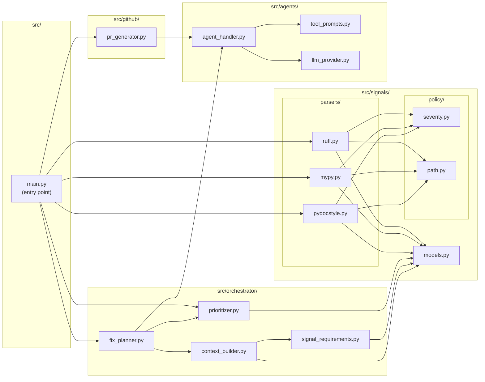
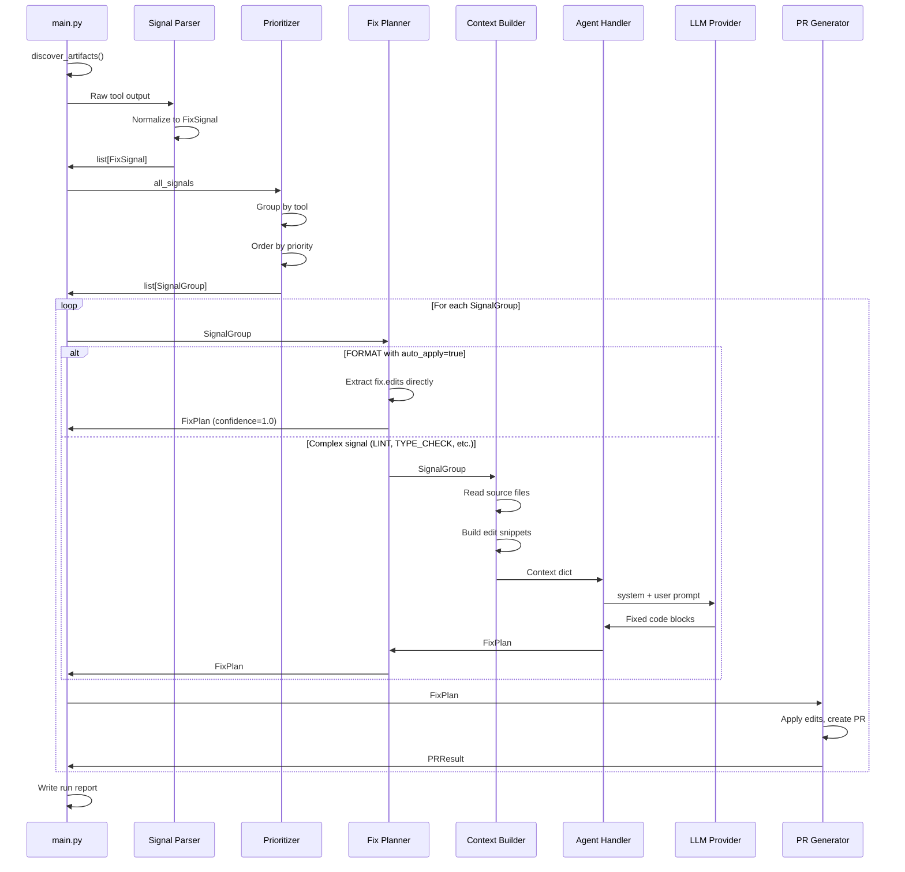

# Module Architecture & Data Flow Diagram

Comprehensive diagram of the CI/CD AI Assistant architecture showing all modules, data structures, and processing flows.

---

## System Overview Diagram

```mermaid
flowchart TB
    subgraph Main["src/main.py — Entry Point"]
        MainModule["main.py<br/>• CLI (--artifacts-dir)<br/>• discover_artifacts()<br/>• parse_artifact()<br/>• run() pipeline<br/>• RunMetrics"]
    end

    subgraph Input["CI/CD Tool Outputs (cicd-artifacts/)"]
        RuffLint["Ruff Lint<br/>JSON"]
        RuffFormat["Ruff Format<br/>Unified Diff"]
        MyPy["MyPy<br/>JSON (NDJSON)"]
        PyDocStyle["Pydocstyle<br/>Text Output"]
    end

    subgraph Signals["signals/ — Data Model & Parsing"]
        subgraph Parsers["parsers/"]
            RuffParser["ruff.py<br/>• parse_ruff_lint_results()<br/>• parse_ruff_format_diff()"]
            MyPyParser["mypy.py<br/>• parse_mypy_results()"]
            PyDocStyleParser["pydocstyle.py<br/>• parse_pydocstyle_results()<br/>• Filters D101-D103 only"]
        end

        subgraph Policy["policy/"]
            SeverityPolicy["severity.py<br/>• severity_for_ruff()<br/>• severity_for_mypy()<br/>• severity_for_pydocstyle()"]
            PathPolicy["path.py<br/>• to_repo_relative()"]
        end

        SignalModels["models.py<br/>FixSignal, SignalType, Severity<br/>Span, Position, TextEdit, Fix"]
    end

    subgraph Orchestrator["orchestrator/ — Coordination Layer"]
        Prioritizer["prioritizer.py<br/>• Prioritizer.prioritize()<br/>• SignalGroup batching<br/>• Tool resolution"]

        SignalReqs["signal_requirements.py<br/>• get_edit_window_spec()<br/>• get_context_requirements()<br/>• EditWindowSpec, ContextRequirements"]

        ContextBuilder["context_builder.py<br/>• ContextBuilder.build_group_context()<br/>• Edit snippets & context windows<br/>• Import/function extraction"]

        FixPlanner["fix_planner.py<br/>• FixPlanner.create_fix_plan()<br/>• Routes to direct or LLM path<br/>• PlannerResult"]
    end

    subgraph Agents["agents/ — LLM Integration"]
        ToolPrompts["tool_prompts.py<br/>• BASE_SYSTEM_PROMPT<br/>• MYPY_TYPE_CHECK_GUIDANCE<br/>• RUFF_LINT_GUIDANCE<br/>• PYDOCSTYLE_DOCSTRING_GUIDANCE<br/>• get_system_prompt()"]

        AgentHandler["agent_handler.py<br/>• AgentHandler.generate_fix_plan()<br/>• Prompt building<br/>• Response parsing<br/>• FixPlan, FileEdit, CodeEdit"]

        LLMProvider["llm_provider.py<br/>• LLMProvider (ABC)<br/>• OpenAIProvider<br/>• ClaudeProvider<br/>• get_provider() factory"]
    end

    subgraph GitHub["github/ — PR Creation"]
        PRGenerator["pr_generator.py<br/>• PRGenerator.create_pr()<br/>• apply_edits_to_content()<br/>• merge_file_edits()<br/>• PRResult"]
    end

    subgraph Output["Output"]
        PR["GitHub Pull Request<br/>with AI-generated fixes"]
    end

    %% Main orchestrates the pipeline
    MainModule -->|"Discovers artifacts"| Input
    MainModule -->|"Coordinates pipeline"| FixPlanner
    MainModule -->|"Initiates PR creation"| PRGenerator

    %% Input connections
    RuffLint --> RuffParser
    RuffFormat --> RuffParser
    MyPy --> MyPyParser
    PyDocStyle --> PyDocStyleParser

    %% Parser dependencies
    RuffParser --> SeverityPolicy
    RuffParser --> PathPolicy
    MyPyParser --> SeverityPolicy
    MyPyParser --> PathPolicy
    PyDocStyleParser --> SeverityPolicy
    PyDocStyleParser --> PathPolicy

    SeverityPolicy --> SignalModels
    PathPolicy --> SignalModels

    %% Parser outputs
    RuffParser -->|"list[FixSignal]"| Prioritizer
    MyPyParser -->|"list[FixSignal]"| Prioritizer
    PyDocStyleParser -->|"list[FixSignal]"| Prioritizer

    %% Orchestrator flow
    Prioritizer -->|"list[SignalGroup]"| FixPlanner

    %% Fix Planner routing
    FixPlanner -->|"FORMAT with auto_apply"| DirectPath["Direct Conversion<br/>FixSignal.fix → FixPlan<br/>No LLM, confidence=1.0"]
    FixPlanner -->|"LINT, TYPE_CHECK,<br/>DOCSTRING"| ContextBuilder

    %% Context building
    SignalReqs --> ContextBuilder
    ContextBuilder -->|"Context dict"| AgentHandler

    %% Agent flow
    ToolPrompts --> AgentHandler
    AgentHandler <--> LLMProvider

    %% Convergence to PR
    DirectPath -->|"FixPlan"| PRGenerator
    AgentHandler -->|"FixPlan"| PRGenerator

    %% Final output
    PRGenerator -->|"PRResult"| PR

    %% Styling
    classDef mainClass fill:#e1f5fe,stroke:#0277bd,stroke-width:3px
    classDef inputClass fill:#e3f2fd,stroke:#1565c0,stroke-width:2px
    classDef signalsClass fill:#f3e5f5,stroke:#7b1fa2,stroke-width:2px
    classDef orchestratorClass fill:#fff3e0,stroke:#ef6c00,stroke-width:2px
    classDef agentsClass fill:#e8f5e9,stroke:#2e7d32,stroke-width:2px
    classDef githubClass fill:#fce4ec,stroke:#c2185b,stroke-width:2px
    classDef outputClass fill:#e0f2f1,stroke:#00695c,stroke-width:2px
    classDef directPath fill:#fffde7,stroke:#f9a825,stroke-width:2px

    class MainModule mainClass
    class RuffLint,RuffFormat,MyPy,PyDocStyle inputClass
    class RuffParser,MyPyParser,PyDocStyleParser,SeverityPolicy,PathPolicy,SignalModels signalsClass
    class Prioritizer,SignalReqs,ContextBuilder,FixPlanner orchestratorClass
    class ToolPrompts,AgentHandler,LLMProvider agentsClass
    class PRGenerator githubClass
    class PR outputClass
    class DirectPath directPath
```



---

## Detailed Module Diagram



---

## Data Flow: FixSignal Through Pipeline



---

## Signal Type Priority & Routing

```mermaid
flowchart TD
    subgraph Priority["Signal Priority Order"]
        direction LR
        TYPE["🟠 TYPE_CHECK<br/>Priority: 1"]
        LINT["🟡 LINT<br/>Priority: 2"]
        DOC["🟢 DOCSTRING<br/>Priority: 3"]
        FMT["🔵 FORMAT<br/>Priority: 4"]
    end

    subgraph Routing["Fix Path Routing"]
        direction TB

        subgraph LLMPath["LLM-Assisted Path"]
            TYPE2["TYPE_CHECK"] --> LLM
            LINT2["LINT"] --> LLM
            DOC2["DOCSTRING"] --> LLM
        end

        subgraph DirectPath["Direct Path"]
            FMT2["FORMAT<br/>(auto_apply=true)"] --> Direct["Direct Conversion<br/>No LLM"]
        end
    end

    SEC --> SEC2
    TYPE --> TYPE2
    LINT --> LINT2
    DOC --> DOC2
    FMT --> FMT2

    LLM --> FixPlan1["FixPlan<br/>confidence: 0.5-1.0"]
    Direct --> FixPlan2["FixPlan<br/>confidence: 1.0"]
```



---

## Context Building Detail

```mermaid
flowchart TB
    subgraph Input
        Signal["FixSignal<br/>file_path, span, rule_code"]
    end

    subgraph WindowSpec["get_edit_window_spec(signal)"]
        direction LR
        Lines["window_type: 'lines'<br/>±N lines around error"]
        Function["window_type: 'function'<br/>Full enclosing function"]
        Imports["window_type: 'imports'<br/>Import block only"]
        TryExcept["window_type: 'try_except'<br/>Enclosing try/except"]
    end

    subgraph RuleMapping["Rule Code → Window Type"]
        F401["F401, I001, E402"] --> Imports
        E722["E722 (bare except)"] --> TryExcept
        F823["F823, return-value"] --> Function
        Default["Default"] --> Lines
    end

    subgraph ContextOutput["Context Components"]
        EditSnippet["edit_snippet<br/>Small region for LLM to fix"]
        ContextWindow["code_context.window<br/>Larger context for understanding"]
        ImportsBlock["code_context.imports<br/>Import statements"]
        EnclosingFunc["code_context.enclosing_function<br/>Full function body"]
        ClassDef["code_context.class_definition<br/>Class header + methods"]
    end

    Signal --> WindowSpec
    WindowSpec --> ContextOutput
```



---

## Tool-Specific Prompt Composition

```mermaid
flowchart LR
    subgraph ToolID["tool_id from SignalGroup"]
        Ruff["ruff"]
        MyPy["mypy"]
        PyDoc["pydocstyle"]
        RuffFmt["ruff-format"]
    end

    subgraph Prompts["Prompt Components"]
        Base["BASE_SYSTEM_PROMPT<br/>• Response format<br/>• Edit types (REPLACE/INSERT/DELETE)<br/>• Position conventions"]

        RuffGuide["RUFF_LINT_GUIDANCE<br/>• Rule categories (F, E, W, N, I)<br/>• Safe removal patterns<br/>• Modernization tips"]

        MyPyGuide["MYPY_TYPE_CHECK_GUIDANCE<br/>• ⚠️ Preserve validation logic<br/>• Type annotation strategies<br/>• Type guards and assertions"]

        PyDocGuide["PYDOCSTYLE_DOCSTRING_GUIDANCE<br/>• Google-style format<br/>• Args/Returns/Raises sections"]
    end

    subgraph Output["get_system_prompt(tool_id)"]
        Final["Combined System Prompt"]
    end

    Ruff --> Base
    Ruff --> RuffGuide
    MyPy --> Base
    MyPy --> MyPyGuide
    PyDoc --> Base
    PyDoc --> PyDocGuide
    RuffFmt --> Base

    Base --> Final
    RuffGuide --> Final
    MyPyGuide --> Final
    PyDocGuide --> Final
```



---

## Edit Application Flow

```mermaid
flowchart TB
    subgraph Input
        FixPlan["FixPlan<br/>file_edits: list[FileEdit]"]
    end

    subgraph Process["apply_edits_to_content()"]
        direction TB
        Sort["Sort edits by position<br/>DESCENDING (bottom-to-top)"]

        subgraph ApplyLoop["For each CodeEdit"]
            Check["Check edit_type"]

            Replace["REPLACE<br/>1. Keep prefix before span.start<br/>2. Insert new content<br/>3. Keep suffix after span.end"]

            Insert["INSERT<br/>span.start == span.end<br/>Insert content at position"]

            Delete["DELETE<br/>content is empty<br/>Remove span region"]
        end
    end

    subgraph Output
        NewContent["Modified file content"]
    end

    FixPlan --> Sort
    Sort --> ApplyLoop
    Check --> Replace
    Check --> Insert
    Check --> Delete
    ApplyLoop --> NewContent

    Note["⚠️ Bottom-to-top order<br/>preserves line numbers<br/>for subsequent edits"]
```



---

## Core Data Structures

### FixSignal (signals/models.py)

```python
class SignalType(str, Enum):
    LINT = "lint"           # Code quality (ruff)
    FORMAT = "format"       # Formatting (ruff format)
    TYPE_CHECK = "type_check"  # Type errors (mypy)
    DOCSTRING = "docstring" # Missing docs (pydocstyle)

class Severity(str, Enum):
    CRITICAL = "critical"
    HIGH = "high"
    MEDIUM = "medium"
    LOW = "low"

@dataclass(frozen=True)
class FixSignal:
    signal_type: SignalType
    severity: Severity
    file_path: str              # Repo-relative path
    span: Optional[Span]        # Error location
    rule_code: Optional[str]    # e.g., "F401", "arg-type", "D101"
    message: str
    docs_url: Optional[str]
    fix: Optional[Fix]          # Deterministic fix (if available)
```

### SignalGroup (orchestrator/prioritizer.py)

```python
@dataclass(frozen=True)
class SignalGroup:
    tool_id: str              # "ruff", "mypy", "pydocstyle", "ruff-format"
    signal_type: SignalType
    signals: list[FixSignal]  # Batched signals (max 3, or all for same-file FORMAT)
```

### EditWindowSpec (orchestrator/signal_requirements.py)

```python
EditWindowType = Literal["lines", "function", "imports", "try_except"]

@dataclass(frozen=True)
class EditWindowSpec:
    window_type: EditWindowType
    lines: int = 0              # For window_type='lines'
    min_context_lines: int = 10
    min_edit_lines: int = 2

@dataclass(frozen=True)
class ContextRequirements:
    include_imports: bool = True
    include_enclosing_function: bool = True
    include_try_except: bool = False
    needs_class_definition: bool = False
    needs_type_aliases: bool = False
    needs_related_functions: bool = False
```

### FixPlan (agents/agent_handler.py)

```python
class EditType(str, Enum):
    REPLACE = "replace"
    INSERT = "insert"
    DELETE = "delete"

@dataclass
class CodeEdit:
    edit_type: EditType
    span: Span
    content: str
    description: str

@dataclass
class FileEdit:
    file_path: str
    edits: list[CodeEdit]
    reasoning: str

@dataclass
class FixPlan:
    group_tool_id: str
    group_signal_type: str
    file_edits: list[FileEdit]
    summary: str
    warnings: list[str]
    confidence: float  # 0.0-1.0
```

### PRResult (github/pr_generator.py)

```python
@dataclass
class PRResult:
    success: bool
    pr_url: Optional[str]
    pr_number: Optional[int]
    branch_name: Optional[str]
    error: Optional[str]
    files_changed: list[str]
```

---

## File Structure

```
src/
├── main.py                      # Entry point: CLI, artifact discovery, pipeline orchestration
│
├── signals/
│   ├── __init__.py
│   ├── models.py                 # FixSignal, SignalType, Severity, Span, Position, Fix, TextEdit
│   ├── parsers/
│   │   ├── __init__.py
│   │   ├── ruff.py              # parse_ruff_lint_results(), parse_ruff_format_diff()
│   │   ├── mypy.py              # parse_mypy_results()
│   │   └── pydocstyle.py        # parse_pydocstyle_results()
│   └── policy/
│       ├── __init__.py
│       ├── severity.py          # severity_for_ruff(), severity_for_mypy(), severity_for_pydocstyle()
│       └── path.py              # to_repo_relative()
│
├── orchestrator/
│   ├── __init__.py
│   ├── prioritizer.py           # SignalGroup, Prioritizer
│   ├── signal_requirements.py   # EditWindowSpec, ContextRequirements, get_edit_window_spec()
│   ├── context_builder.py       # ContextBuilder.build_group_context()
│   └── fix_planner.py           # FixPlanner.create_fix_plan(), PlannerResult
│
├── agents/
│   ├── __init__.py
│   ├── tool_prompts.py          # BASE_SYSTEM_PROMPT, tool-specific guidance, get_system_prompt()
│   ├── agent_handler.py         # AgentHandler, FixPlan, FileEdit, CodeEdit, AgentResult
│   └── llm_provider.py          # LLMProvider (ABC), OpenAIProvider, ClaudeProvider, get_provider()
│
└── github/
    ├── __init__.py
    └── pr_generator.py          # PRGenerator, PRResult, apply_edits_to_content()
```

---

## Entry Point (src/main.py)

The actual implementation in `src/main.py`:

```python
# Usage:
#   python -m main --artifacts-dir ./cicd-artifacts
#
# Environment variables:
#   CONFIDENCE_THRESHOLD  - Min confidence for PR inclusion (default: 0.7)
#   SIGNALS_PER_PR        - Max signals per group (default: 4)
#   LLM_PROVIDER          - "anthropic" (default) or "openai"
#   LOG_LEVEL             - "info" (default) or "debug"
#   TARGET_REPO_ROOT      - Repository root for path normalization

def run(artifacts_dir: Path, config: dict) -> RunMetrics:
    metrics = RunMetrics()

    # 1. Discover and parse artifacts
    artifact_files = discover_artifacts(artifacts_dir)
    all_signals: list[FixSignal] = []

    for path in artifact_files:
        parser_type = _route_artifact(path)  # "mypy", "ruff-lint", etc.
        if parser_type:
            signals = parse_artifact(path, parser_type, config["repo_root"])
            all_signals.extend(signals)

    # 2. Prioritize and group
    prioritizer = Prioritizer(max_group_size=config["signals_per_pr"])
    groups = prioritizer.prioritize(all_signals)

    # 3. Generate fix plans and create PRs
    planner = FixPlanner(llm_provider=config["llm_provider"])
    pr_generator = PRGenerator(confidence_threshold=config["confidence_threshold"])

    for group in groups:
        planner_result = planner.create_fix_plan(group)

        if planner_result.success:
            pr_result = pr_generator.create_pr(planner_result.fix_plan)
            metrics.record_pr(pr_result, group)

    # 4. Write run report to logs/
    return metrics
```

---

## Design Principles

| Principle | Implementation |
|-----------|----------------|
| **Tool Agnosticism** | All tools normalized to `FixSignal` — parsers encapsulate tool-specific logic |
| **Two-Tier Fix Strategy** | Fast deterministic path for FORMAT, intelligent LLM path for complex signals |
| **Priority-Based Processing** | TYPE_CHECK > LINT > DOCSTRING > FORMAT |
| **Signal-Specific Context** | `EditWindowSpec` and `ContextRequirements` tailor context per rule code |
| **Tool-Specific Prompts** | Each tool gets specialized LLM guidance (mypy: preserve validation, ruff: safe removal, etc.) |
| **Immutable Data Flow** | Frozen dataclasses prevent accidental mutations between pipeline stages |
| **Provider Abstraction** | `LLMProvider` ABC allows swapping OpenAI/Anthropic without changing business logic |
| **Bottom-to-Top Edit Application** | Preserves line numbers when applying multiple edits to same file |
